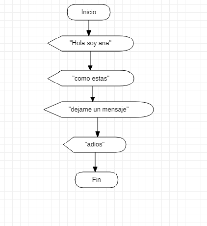

# **PROGRAMACION**


## **FECHA** <br>

### **septiembre 02 2021** <br>
 
aprendi con el instructore henry mas sobre el
programa de Star UML, tambien como ejecutar  
mensajes con el progama de excel con 
visual. <br>

**EJEMPLO DE EXECEL VISUAL BASIC** <br>

```
Sub ejemplo()

    MsgBox "Hola nuevo mundo"

End Sub
```
**COMPROMISO**

tambien dejo como compromiso hacer tres 
anuncio diferentes y su representancion 
grafica con Star UML <br>

**EJERCICIO CON EXECEL VISUAL BASIC** <br>

```
Sub ejemplo()

    MsgBox "Hola soy Ana"
    MsgBox "Como estas"
    MsgBox "dejame un mensaje"
    MsgBox "Adios"

End Sub
```
**EJERCICIO GRAFICO CON STAR UML**

