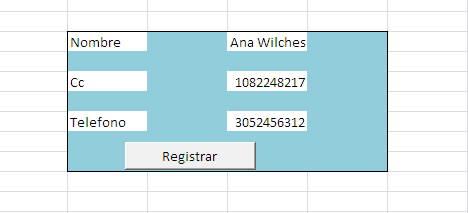

# **PROGRAMACION**


## **septiembre 20 2021** <br>
aprendimos a crear funciones con visual basic ejecutando " Function " tambien a hacer un registro en un cuadro y pasarlo a otra parte 
### **EXECEL VISUAL BASIC**
**EJEMPLO 1**
```
Sub ejercicio1()
    datos.Cells(3,1) = form.Cells(6,4)
    datos.Cells(3,2) = form.Cells(8,4)
    MsgBox "registro almacenado"
    form.Cells(6,4) = Empty
    form.Cells(8,4) = ""
End Sub
```
**EJEMPLO 2**
```
Function promediosena(a, b, c)
    promedio(a + b + c) / 3
    promediosena = promedio 
End Function
```
**EJERCICIO 1**
```
Sub prueba2()
    datos.Cells(3, 1) = form.Cells(3, 4)
    datos.Cells(3, 2) = form.Cells(5, 4)
    datos.Cells(2, 1) = form.Cells(3, 2)
    datos.Cells(2, 2) = form.Cells(5, 2)
    datos.Cells(2, 3) = form.Cells(7, 2)
    datos.Cells(3, 3) = form.Cells(7, 4)
    MsgBox "recibido"
    form.Cells(3, 4) = Empty
    form.Cells(5, 4) = ""
    form.Cells(3, 2) = ""
    form.Cells(5, 2) = ""
    form.Cells(7, 2) = ""
    form.Cells(7, 4) = ""
End Sub
```
**EJERCICIO 2**
```
Function misnotas(a, b, c, d, e)
    l = (a + b + c + d + e) / 5
    If (l > 7) Then
        misnotas = "el promedio es mayor" & l & " gano "
    Else
        misnotas = "el promedio es menor" & l & " perdio "
    End If
End Function
```
**FOTO DE EXECEL**<br>

