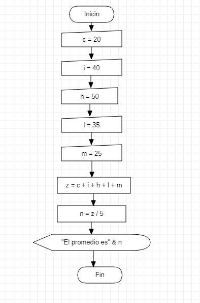

# **PROGRAMACION**


## **FECHA** <br>

### **septiembre 09 2021** <br>

en la clase se utilizaron los programas de excel visual basic 
y StarUML para seguir al fondo de la programacion cada vez mas 
esta vez se utilizo la combinacion de "MsgBox" y el "InputBox" 
recordamos que el comando "MsgBox" es para mostrar en execel lo 
que colocamos en visual basic y con el comando "InputBox" si 
queremos decirle o pedirle al usuario que digite informacion 
<br>

**EJEMPLO DE EXECEL VISAUL BASIC**
```
Sub ejemplo () 
    a = InputBox("digite primer numero")
    b = InputBox("digite segundo numero")
    c = a + b 
    MsgBox "la suma es " & c
End Sub
```
**EJERCICIO DE EXECEL VISUAL BASIC** 

```
Sub promedio()
    c = InputBox("digita primer número")
    i = InputBox("digita segundo número")
    h = InputBox("digita tercer número")
    l = InputBox("digita cuarto número")
    m = InputBox("digita quinto número")
    Z = Int(c) + Int(i) + Int(h) + Int(l) + Int(m)
    n = Z / 5
    MsgBox "El promedio es" & n
End Sub
```
**DIAGRAMA DE FLUJO DE STAR UML**

